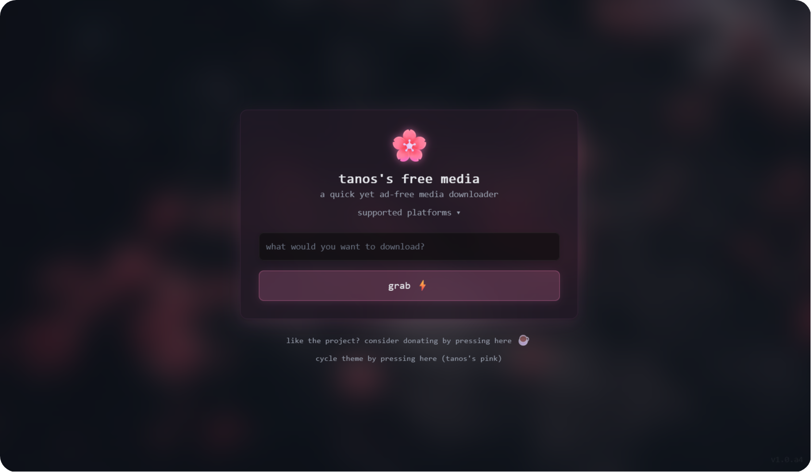

# tanos.fm

_**tanos**'s **f**ree **m**edia is a quick yet ad-free media downloader, made for educational purposes only._


<div align="center">

**🚀 A quick, ad-free media downloader built for educational exploration, supporting as many websites as possible**

[🌐 Live Demo](https://tanos.is-a.dev/fm) • [📖 Documentation](#) • [💡 Request Feature](https://github.com/tanosshi/tanos.fm/issues)

</div>

---

## 📸 Preview Gallery

<div align="center">
  
  <p><em>A nice front-end for an eye pleasing experience, made for most modern devices.</em></p>
</div>

---

## ✨ What compares us to others?

<table>
<tr>
<td width="33%" align="center">

### 🚫 **Zero Ads**

Clean experience without interruptions

</td>
<td width="33%" align="center">

### ⚡ **Rapid**

Direct download, with quick FFmpeg performance

</td>
<td width="33%" align="center">

### 🎯 **Support**

Most sites you can think of are available for download

</td>
</tr>
</table>

---

## 🚀 Quick Start Guide

### Prerequisites

- **Node.js** (v16.0.0 or higher)
- **npm** or **yarn**
- **FFmpeg** (set up to the path just incase)

### 🔧 Installation

```bash
# 📦 Install all dependencies
npm run "install-deps"

# 🚀 Build and launch
npm start
```

> **💡 Info:** Make sure your `server\.env` file is properly configured before starting! Redirections for the proper links are placed in the `server\.env.example` file.

---

## 🎯 Feature Roadmap

<div align="center">

| Feature                                                                              | Status             | Priority | ETA |
| ------------------------------------------------------------------------------------ | ------------------ | -------- | --- |
| 🎧 Spotify Integration                                                               | ✅ **Complete**    | High     | ✅  |
| 📺 YouTube Integration                                                               | ✅ **Complete**    | High     | ✅  |
| 🎶 YouTube Music Integration                                                         | ✅ **Complete**    | High     | ✅  |
| 🎭 TikTok Integration                                                                | ✅ **Complete**    | High     | ✅  |
| 🐦 Twitter Integration                                                               | ✅ **Complete**    | High     | ✅  |
| 📷 Instagram Integration                                                             | ✅ **Complete**    | High     | ✅  |
| ☁️ SoundCloud Integration                                                            | ✅ **Complete**    | High     | ✅  |
| 📌 Pinterest Integration                                                             | ✅ **Complete**    | Medium   | ✅  |
| 👽 Reddit Integration                                                                | ✅ **Complete**    | High     | ✅  |
| 📁 Indirect Google Drive Download                                                    | ✅ **Complete**    | Low      | ✅  |
| 🔧 FFmpeg Optimization                                                               | ✅ **Complete**    | High     | ✅  |
| 📹 Full Quality Video Downloads                                                      | ✅ **Complete**    | Medium   | ✅  |
| 🧹 Code Cleanup & UI Polish                                                          | ✅ **Complete**    | High     | ✅  |
| 💻 Modern Frontend                                                                   | ✅ **Complete**    | High     | ✅  |
| 🎨 Enhanced UI Details                                                               | ✅ **Complete**    | Medium   | ✅  |
| 🎤 Lyrics Fix                                                                        | ✅ **Complete**    | Lowest   | ✅  |
| 📥 Download System                                                                   | ✅ **Complete**    | High     | ✅  |
| 🚦 Rate limiting system                                                              | ✅ **Complete**    | High     | ✅  |
| 🔌 IP Address Blocker                                                                | ✅ **Complete**    | High     | ✅  |
| 🤖 Write <a href="https://github.com/tanosshi/reddit-scraper">scraper for Reddit</a> | ✅ **Completed**   | Highest  | ✅  |
| 🎛️ A panel with comments                                                             | 🔄 **Planned**     | Low      | TBD |
| 📂 Bulk download playlist/urls                                                       | 🔄 **Planned**     | Low      | TBD |
| 📼 Add opus/webm/flac support                                                        | 🔄 **Planned**     | Low      | TBD |
| 🔍 Search for music                                                                  | 🔄 **Planned**     | Lowered  | TBD |
| 🔑 API Keys for external projects                                                    | 🟡 **Almost done** | Lowered  | ⏳  |

</div>

## 🤝 The Developer

<div align="center">
<table>
<tr>
<td align="center" width="200px">
<br>
<strong>tanos</strong><br>
<sub>🎯 Lead Developer</sub><br>
<em>Frontend & Backend Developer</em>
</td>
</tr>
</table>


</div>


<div align="center">
</div>

## ⚠️ Important Notice

<div align="center">
<blockquote>
<strong>🎓 Educational Purpose Only</strong><br>
This project is created for educational and research purposes. Please respect copyright laws and terms of service of the platforms you interact with.
</blockquote>
</div>

---

<div align="center">

### 🚀 Want to get started?

**[Try the Demo (Front-end only)](https://tanos.is-a.dev/fm)** | **[View Source](#)** | **[Contribute](#)**

---

_Always made with ❤️ by THE tanos_

</div>

